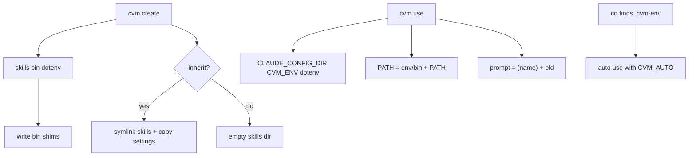

# Venv-like behaviors for cvm — Implementation Plan

> **For agentic workers:** REQUIRED SUB-SKILL: Use superpowers:subagent-driven-development (recommended) or superpowers:executing-plans to implement this plan task-by-task. Steps use checkbox (`- [ ]`) syntax for tracking.

**Goal:** Bring Python-venv ergonomics to cvm — eager env layout, shell prompt decoration, `bin/` on PATH with shims, `--inherit` on create, and `.cvm-env` auto-activate — without adding `cvm skill add`.

**Architecture:** Rust owns filesystem layout, shim generation, inherit logic, and `run_in_env` PATH. Shell hooks (`cvm init`) own prompt decoration, PATH prepend/restore, and `.cvm-env` auto-activation, because those need access to the live shell prompt/`cd` and careful restore semantics that the current KEY=VALUE activate protocol cannot express alone.

**Tech Stack:** Rust (`clap`, existing `env`/`shell` modules), bash/zsh/fish/PowerShell hooks, Unix shell shims + Windows `.cmd` shims.

## Global Constraints

- Do **not** add a `cvm skill add` command.
- Do **not** attempt full Node/npm isolation (no local npm prefix / node_modules root).
- Preserve existing activate protocol: `__resolve-activate` still prints `KEY=VALUE` lines; `__resolve-deactivate` still prints names to unset for dotenv/`CLAUDE_CONFIG_DIR`/`CVM_ENV`. PATH and PS1 restore live in the shell hooks via `CVM_OLD_PATH` / `CVM_OLD_PS1` (and PowerShell equivalents).
- Re-running `cvm init` after upgrade remains required for hook changes (same as today with `cvm update` messaging).
- English commit messages (Conventional Commits + What/Why/How). User-facing README can stay English to match the repo.
- Prefer extending tests inside existing `#[cfg(test)]` modules in `src/env.rs` (and new module tests) — the repo has no separate `tests/` harness yet.

## Out of scope

- `cvm skill add`
- Cloning/wrapping all of `npx` for arbitrary packages
- Changing how Claude Code itself discovers skills beyond `CLAUDE_CONFIG_DIR`

## Locked product decisions

| Topic | Decision |
|-------|----------|
| Layout on create | Create `skills/`, `bin/`, and `.env` (same header as `ensure_dotenv_file`) |
| Old envs | Lazy-ensure `bin/` + shims on activate / `run_in_env` if missing |
| Prompt | `(name) ` prefix; no stacking when switching envs; restore on deactivate |
| Shims | `claude` and `skills` (+ `.cmd` on Windows); derive env dir from shim location; exec real binary from PATH with env `bin` removed |
| `skills` shim | `npx --yes skills "$@"` (or real `skills` if on cleaned PATH) — not a new cvm subcommand |
| Inherit flag | `cvm create <env> --inherit`: symlink each `~/.claude/skills/*` into env `skills/` (copy fallback); **copy** `settings.json` if present |
| Auto-activate | `.cvm-env` (first non-empty, non-`#` line = env name); set `CVM_AUTO=1` only for auto path; manual `cvm use` clears `CVM_AUTO`; leave directory tree → deactivate only if `CVM_AUTO=1` |



## File map

| File | Responsibility |
|------|----------------|
| `src/env.rs` | `create_env` layout, lazy `ensure_env_bin`, inherit, PATH in `run_in_env` |
| `src/shims.rs` (new) | Generate Unix + Windows shim script contents; write into `bin/` |
| `src/cli.rs` | `--inherit` on `Create` |
| `src/main.rs` | Wire `inherit`; create success messages |
| `src/shell/bash.rs` / `zsh.rs` / `fish.rs` / `powershell.rs` | Prompt, PATH, auto-activate helpers |
| `src/shell/mod.rs` | Re-export if needed |
| `README.md` | Document all five behaviors |

---

### Task 1: Eager layout on create

**Files:**
- Modify: `src/env.rs` (`create_env`, reuse dotenv header helper)
- Modify: `README.md` (layout section)
- Test: `src/env.rs` `#[cfg(test)]`

**Interfaces:**
- Consumes: existing `create_env(name, anonymous)`, `ensure_dotenv_file` / dotenv header constants
- Produces: `create_env` also creates `skills/`, `bin/`, `.env`; optional `pub fn ensure_env_layout(dir: &Path) -> Result<()>` used by create and later by activate

- [ ] **Step 1: Write failing tests**

```rust
#[test]
fn create_env_creates_skills_bin_and_dotenv() {
    // use temp home via env or refactor create_env to accept base — prefer testing
    // ensure_env_layout(dir) directly if create_env is hard to isolate
    let dir = tempfile::tempdir().unwrap();
    ensure_env_layout(dir.path()).unwrap();
    assert!(dir.path().join("skills").is_dir());
    assert!(dir.path().join("bin").is_dir());
    assert!(dir.path().join(".env").is_file());
}
```

If `tempfile` is not a dev-dependency yet, add it under `[dev-dependencies]` in `Cargo.toml`, or use `std::env::temp_dir` + random suffix like existing tests.

- [ ] **Step 2: Implement `ensure_env_layout` and call from `create_env`**

```rust
pub fn ensure_env_layout(dir: &Path) -> Result<()> {
    fs::create_dir_all(dir.join("skills"))?;
    fs::create_dir_all(dir.join("bin"))?;
    let _ = ensure_dotenv_file(dir)?;
    Ok(())
}
```

Call after `create_dir_all` / credentials copy in `create_env`.

- [ ] **Step 3: Run tests**

Run: `cargo test create_env_creates_skills_bin_and_dotenv -- --nocapture`  
Expected: PASS

- [ ] **Step 4: Update README layout tree** under How It Works / usage to list `skills/`, `bin/`, `.env`.

- [ ] **Step 5: Commit**

```bash
git add src/env.rs README.md Cargo.toml Cargo.lock
git commit -m "$(cat <<'EOF'
feat(cvm): create skills, bin, and .env on env create

What:
New environments get skills/, bin/, and a starter .env file up front.

Why:
Installers and hooks expect a predictable layout; empty env dirs caused avoidable friction.

How:
Add ensure_env_layout and invoke it from create_env, reusing the existing dotenv header helper.
EOF
)"
```

---

### Task 2: Shell prompt shows `(env)`

**Files:**
- Modify: `src/shell/bash.rs`, `src/shell/zsh.rs`, `src/shell/fish.rs`, `src/shell/powershell.rs`
- Modify: `README.md` (short note under activate)

**Interfaces:**
- Consumes: `CVM_ENV` exported by existing activate path
- Produces: hook-side prompt backup/restore; no Rust API change

- [ ] **Step 1: Bash — after successful activate exports, decorate PS1**

Inside `use|activate` branch, after the export loop:

```bash
if [ -z "${CVM_OLD_PS1+x}" ]; then
  CVM_OLD_PS1="${PS1-}"
  export CVM_OLD_PS1
fi
PS1="(${CVM_ENV}) ${CVM_OLD_PS1}"
export PS1
```

On `deactivate`, before/after unset loop:

```bash
if [ -n "${CVM_OLD_PS1+x}" ]; then
  PS1="$CVM_OLD_PS1"
  export PS1
  unset CVM_OLD_PS1
fi
```

When switching env (activate while already active), reset from `CVM_OLD_PS1` then apply new `(name)` — do **not** nest.

- [ ] **Step 2: Mirror for zsh** (same `PS1` pattern).

- [ ] **Step 3: Fish** — wrap `fish_prompt`: save previous with `functions -c fish_prompt __cvm_old_fish_prompt` once; new prompt prints `($CVM_ENV) ` then calls old. On deactivate, `functions -e fish_prompt` and restore copy if present.

- [ ] **Step 4: PowerShell** — on activate, if `CVM_OLD_PROMPT` not set, store `(Get-Content function:prompt)` into session variable; define:

```powershell
function prompt {
    "($env:CVM_ENV) " + (& ([scriptblock]::Create($env:CVM_OLD_PROMPT)))
}
```

Prefer a script-scoped backup if env-var size is problematic — use `$global:CVM_OLD_PROMPT` function body string. On deactivate, restore `function:prompt` and clear backup. Clear `CVM_AUTO` handling comes in Task 5; for now only prompt.

- [ ] **Step 5: README** — note that prompt decoration requires shell integration from `cvm init`.

- [ ] **Step 6: Commit**

```bash
git commit -m "$(cat <<'EOF'
feat(cvm): show active environment name in shell prompt

What:
Activated shells prefix the prompt with (env-name); deactivate restores the prior prompt.

Why:
Makes it obvious which Claude config environment is active before running tools.

How:
Extend cvm init hooks for bash, zsh, fish, and PowerShell to backup and rewrite the prompt using CVM_ENV.
EOF
)"
```

---

### Task 3: Shims module + PATH integration

**Files:**
- Create: `src/shims.rs`
- Modify: `src/main.rs` or `src/lib`-less binary — add `mod shims;` in `src/main.rs`
- Modify: `src/env.rs` (`ensure_env_bin`, `run_in_env`, call from `resolve_activate` side-effect OK)
- Modify: all four `src/shell/*.rs` hooks for PATH
- Modify: `README.md`

**Interfaces:**
- Consumes: `ensure_env_layout`, env directory path
- Produces:
  - `pub fn write_env_shims(env_dir: &Path) -> Result<()>`
  - `pub fn env_bin_dir(env_dir: &Path) -> PathBuf`
  - `run_in_env` prepends `env_bin_dir` to child PATH
  - Hooks set `CVM_OLD_PATH` / restore on deactivate

- [ ] **Step 1: Implement Unix shim body** in `src/shims.rs`

```rust
fn unix_shim(real_command_resolver: &str, exec_line: &str) -> String {
    // real_command_resolver: shell snippet that sets REAL=... excluding this bin dir
    // exec_line: e.g. exec "$REAL" "$@"   OR  exec npx --yes skills "$@"
    format!(r#"#!/bin/sh
DIR=$(CDPATH= cd -- "$(dirname "$0")/.." && pwd)
export CLAUDE_CONFIG_DIR="$DIR"
export CVM_ENV=$(basename "$DIR")
BIN="$DIR/bin"
PATH_WITHOUT_BIN=$(printf '%s' "$PATH" | awk -v bin="$BIN" 'BEGIN{{RS=":";ORS=":"}} $0!=bin {{print}}' | sed 's/:$//')
# resolve and exec …
"#)
}
```

Prefer a simpler portable approach: 

```sh
#!/bin/sh
DIR=$(CDPATH= cd -- "$(dirname "$0")/.." && pwd)
export CLAUDE_CONFIG_DIR="$DIR"
export CVM_ENV=$(basename "$DIR")
BIN_DIR="$DIR/bin"
OLD_IFS=$IFS
IFS=:
NEW_PATH=
for p in $PATH; do
  [ "$p" = "$BIN_DIR" ] && continue
  NEW_PATH="${NEW_PATH:+$NEW_PATH:}$p"
done
IFS=$OLD_IFS
export PATH="$NEW_PATH"
hash -r 2>/dev/null || true
exec claude "$@"   # or: exec npx --yes skills "$@"
```

Windows `claude.cmd`:

```bat
@echo off
set "DIR=%~dp0.."
for %%I in ("%DIR%") do set "DIR=%%~fI"
set "CLAUDE_CONFIG_DIR=%DIR%"
for %%I in ("%DIR%") do set "CVM_ENV=%%~nxI"
set "PATH=%PATH:*%~dp0=;%PATH%"
where claude >NUL 2>&1
claude %*
```

(Tune Windows PATH stripping carefully; test on pwsh.)

- [ ] **Step 2: `write_env_shims`** writes `bin/claude`, `bin/skills` (chmod 755 on Unix) and `bin/claude.cmd`, `bin/skills.cmd`.

- [ ] **Step 3: Call `write_env_shims` from `ensure_env_layout` / `create_env`, and from `resolve_activate` + `run_in_env` (lazy).**

- [ ] **Step 4: `run_in_env` — prepend bin to PATH**

```rust
let bin = dir.join("bin");
let mut path = env::var_os("PATH").unwrap_or_default();
let mut new_path = OsString::from(&bin);
#[cfg(windows)]
new_path.push(";");
#[cfg(not(windows))]
new_path.push(":");
new_path.push(&path);
cmd.env("PATH", new_path);
```

- [ ] **Step 5: Hooks — PATH backup/restore**

After activate exports:

```bash
if [ -z "${CVM_OLD_PATH+x}" ]; then
  export CVM_OLD_PATH="$PATH"
fi
export PATH="${CLAUDE_CONFIG_DIR}/bin:${CVM_OLD_PATH}"
```

Deactivate:

```bash
if [ -n "${CVM_OLD_PATH+x}" ]; then
  export PATH="$CVM_OLD_PATH"
  unset CVM_OLD_PATH
fi
```

Same for zsh/fish/PowerShell (`$env:Path`).

- [ ] **Step 6: Unit test** that `write_env_shims` creates expected filenames in a temp dir.

- [ ] **Step 7: README** — document `bin/` shims and PATH behavior.

- [ ] **Step 8: Commit**

```bash
git commit -m "$(cat <<'EOF'
feat(cvm): add env bin shims and prepend them on activate

What:
Each environment gets bin/claude and bin/skills shims; activation and run/open put that bin first on PATH.

Why:
Keeps Claude and the skills CLI bound to the active config dir the same way venv binds pip/python.

How:
Generate portable shims, lazy-ensure them on activate/run, and extend shell hooks to backup and restore PATH.
EOF
)"
```

---

### Task 4: `--inherit` on create

**Files:**
- Modify: `src/cli.rs`, `src/main.rs`, `src/env.rs`
- Modify: `README.md`

**Interfaces:**
- Consumes: `create_env`, `global_claude_dir`, `ensure_env_layout`
- Produces: `create_env(name, anonymous, inherit) -> Result<(PathBuf, bool, InheritStats)>` or separate `inherit_global_assets(env_dir) -> Result<InheritStats>`
- `InheritStats { skills_linked: usize, skills_copied: usize, settings_copied: bool }`

- [ ] **Step 1: CLI flag**

```rust
/// Seed the environment from ~/.claude (skills links + settings copy)
#[arg(long)]
inherit: bool,
```

- [ ] **Step 2: Implement inherit**

```rust
pub fn inherit_from_global(env_dir: &Path) -> Result<InheritStats> {
    let global = global_claude_dir()?;
    let mut stats = InheritStats::default();
    let skills_src = global.join("skills");
    let skills_dst = env_dir.join("skills");
    fs::create_dir_all(&skills_dst)?;
    if skills_src.is_dir() {
        for entry in fs::read_dir(&skills_src)? {
            let entry = entry?;
            let name = entry.file_name();
            let dest = skills_dst.join(&name);
            if dest.exists() { continue; }
            match symlink_dir_or_copy(entry.path(), &dest) {
                Ok(LinkKind::Symlink) => stats.skills_linked += 1,
                Ok(LinkKind::Copy) => stats.skills_copied += 1,
                Err(e) => return Err(e),
            }
        }
    }
    let settings_src = global.join("settings.json");
    let settings_dst = env_dir.join("settings.json");
    if settings_src.is_file() && !settings_dst.exists() {
        fs::copy(&settings_src, &settings_dst)?;
        stats.settings_copied = true;
    }
    Ok(stats)
}
```

Use `std::os::unix::fs::symlink` / `std::os::windows::fs::symlink_dir` (and `symlink_file` if needed); on error, `fs` recursive copy.

- [ ] **Step 3: Wire main** — print dimmed summary of inherit stats.

- [ ] **Step 4: Tests** — temp global + env dirs; one fake skill folder; assert link or copy exists; settings copied.

- [ ] **Step 5: README** — `cvm create work --inherit` in examples + command table.

- [ ] **Step 6: Commit**

```bash
git commit -m "$(cat <<'EOF'
feat(cvm): add --inherit to seed envs from ~/.claude

What:
create --inherit links global skills into the new env and copies settings.json when present.

Why:
Mirrors venv --system-site-packages for the Claude config pieces people actually share.

How:
After layout creation, symlink-or-copy ~/.claude/skills entries and copy settings.json into the env.
EOF
)"
```

---

### Task 5: Auto-activate from `.cvm-env`

**Files:**
- Modify: all four `src/shell/*.rs`
- Modify: `README.md`
- Optional: add `src/env.rs` helper only if validating name server-side — not required for MVP (hook calls `cvm use`)

**Interfaces:**
- Consumes: existing hook `use`/`deactivate` branches; `CVM_ENV`
- Produces: `__cvm_auto_check` helper; `CVM_AUTO`, `CVM_AUTO_ROOT` (directory where `.cvm-env` was found); manual `use` clears `CVM_AUTO`

- [ ] **Step 1: Define `.cvm-env` format in README** — single env name, `#` comments allowed.

- [ ] **Step 2: Bash helper**

```bash
__cvm_auto_check() {
  [ "${CVM_AUTO_LAST_PWD-}" = "$PWD" ] && return 0
  CVM_AUTO_LAST_PWD=$PWD
  local dir="$PWD" found="" name=""
  while [ -n "$dir" ]; do
    if [ -f "$dir/.cvm-env" ]; then
      found="$dir"
      name=$(grep -v '^[[:space:]]*#' "$dir/.cvm-env" | sed '/^[[:space:]]*$/d' | head -n1 | tr -d '\r' | sed 's/^[[:space:]]*//;s/[[:space:]]*$//')
      break
    fi
    [ "$dir" = "/" ] && break
    dir=$(dirname "$dir")
  done
  if [ -n "$name" ]; then
    if [ "${CVM_ENV-}" != "$name" ]; then
      cvm use "$name" || return $?
      export CVM_AUTO=1
      export CVM_AUTO_ROOT="$found"
    fi
  elif [ "${CVM_AUTO-}" = "1" ]; then
    cvm deactivate
    unset CVM_AUTO CVM_AUTO_ROOT
  fi
}
```

Wire into `PROMPT_COMMAND` (bash) carefully: append without clobbering user `PROMPT_COMMAND`.

- [ ] **Step 3: On manual `use|activate`**, `unset CVM_AUTO CVM_AUTO_ROOT` after success so leaving the directory does not auto-deactivate a deliberate activation.

- [ ] **Step 4: zsh** — `autoload -U add-zsh-hook`; `add-zsh-hook chpwd __cvm_auto_check`; also run once at init end.

- [ ] **Step 5: fish** — `function __cvm_auto_check --on-variable PWD`; run once at init.

- [ ] **Step 6: PowerShell** — invoke from the decorated `prompt` function (or `Set-PSReadLineKeyHandler` is overkill); track last pwd in `$global:CVM_AUTO_LAST_PWD`.

- [ ] **Step 7: README** — `.cvm-env` example + optional direnv snippet:

```sh
# .envrc (direnv alternative)
eval "$(cvm __resolve-activate myenv | sed 's/^/export /')"
```

(Exact direnv snippet should match activate output format.)

- [ ] **Step 8: Manual test checklist** (no automated shell-hook tests in-repo): create env, write `.cvm-env`, open new shell with init, `cd` in/out, manual `cvm use` then `cd` out (must stay active).

- [ ] **Step 9: Commit**

```bash
git commit -m "$(cat <<'EOF'
feat(cvm): auto-activate environments from .cvm-env

What:
Shell integration detects .cvm-env on cd and activates that environment; leaving auto-deactivates only auto sessions.

Why:
Project-correlated Claude configs should activate like direnv/venv without a manual cvm use every time.

How:
Add per-shell cd/prompt hooks that read .cvm-env, call cvm use, and track CVM_AUTO for safe deactivate.
EOF
)"
```

---

## Verification (end-to-end)

After all tasks:

1. `cargo test`
2. `cargo build`
3. Manual bash (or pwsh on Windows):
   - `cvm create demo` → confirm `skills/`, `bin/`, `.env`, shims exist
   - `eval "$(cvm init bash)"` → `cvm use demo` → prompt shows `(demo)`; `which claude` prefers env bin; `echo $PATH` starts with env bin
   - `cvm deactivate` → prompt and PATH restored
   - `cvm create demo2 --inherit` → linked/copied skills if global has any
   - `echo demo > /tmp/proj/.cvm-env` → `cd /tmp/proj` auto-activates; `cd /` auto-deactivates; `cvm use demo` then `cd /` stays active

## Spec coverage check

| Requirement | Task |
|-------------|------|
| Eager layout | Task 1 |
| Prompt `(env)` | Task 2 |
| `bin/` + shims + PATH | Task 3 |
| `--inherit` | Task 4 |
| `.cvm-env` auto-activate | Task 5 |
| No `cvm skill add` | Honored globally |

## Placeholder / consistency self-review

- No TBD left for naming: `--inherit`, `CVM_OLD_PATH`, `CVM_OLD_PS1`, `CVM_AUTO`, `.cvm-env`.
- `create_env` signature grows an `inherit: bool` in Task 4; update all call sites (`main` create, `import` path that calls `create_env(..., false)` stays `false` for inherit unless we later add import flag — **keep import at `inherit: false`**).
- Shell hook growth is intentional; keep helpers named `__cvm_*` to avoid collisions.
